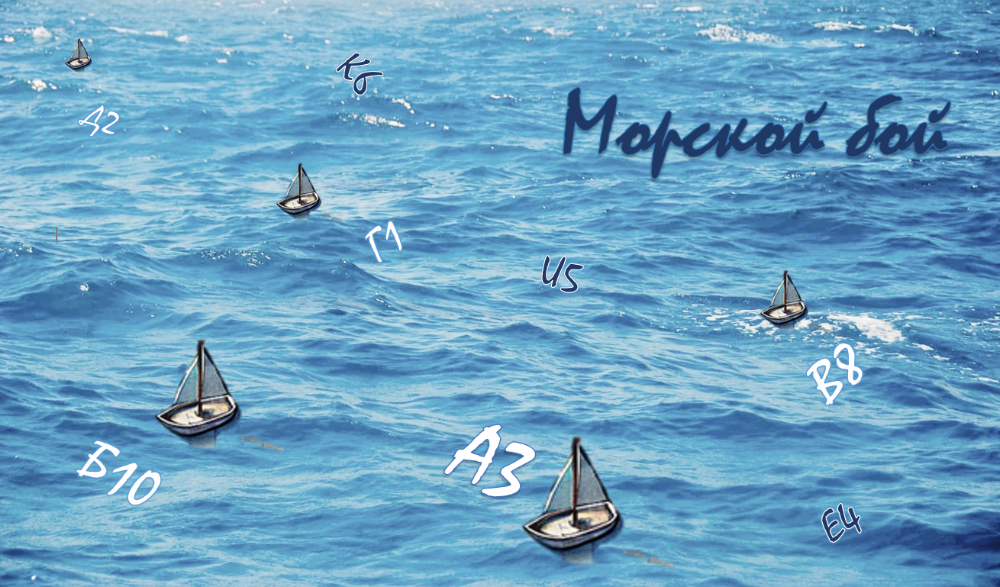
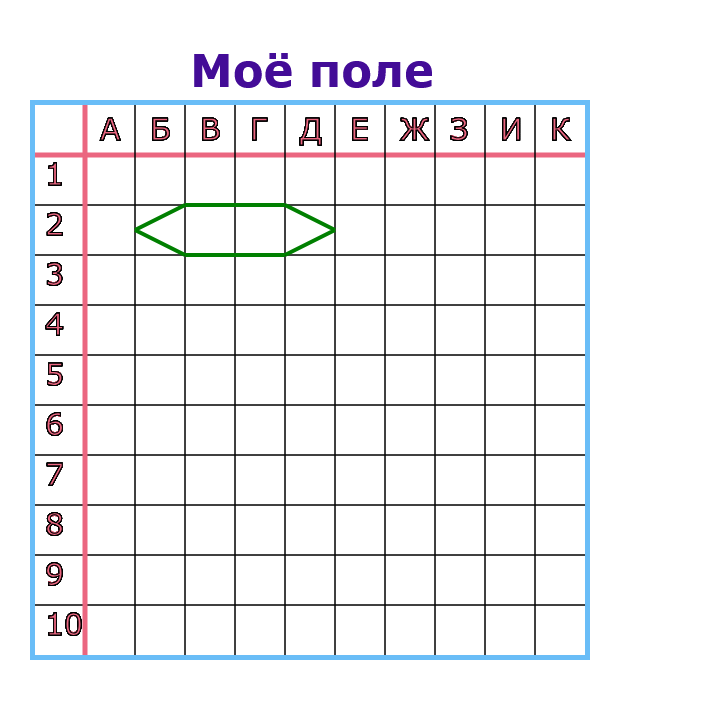
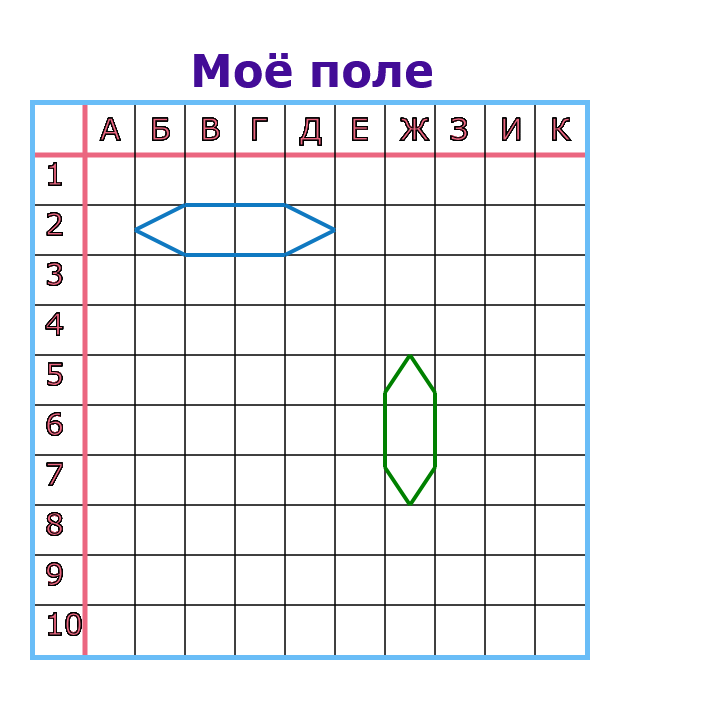
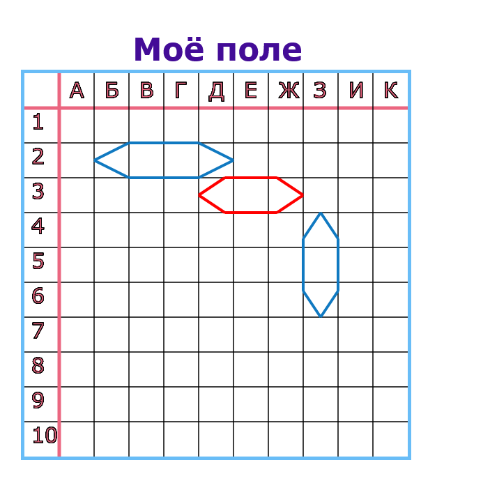
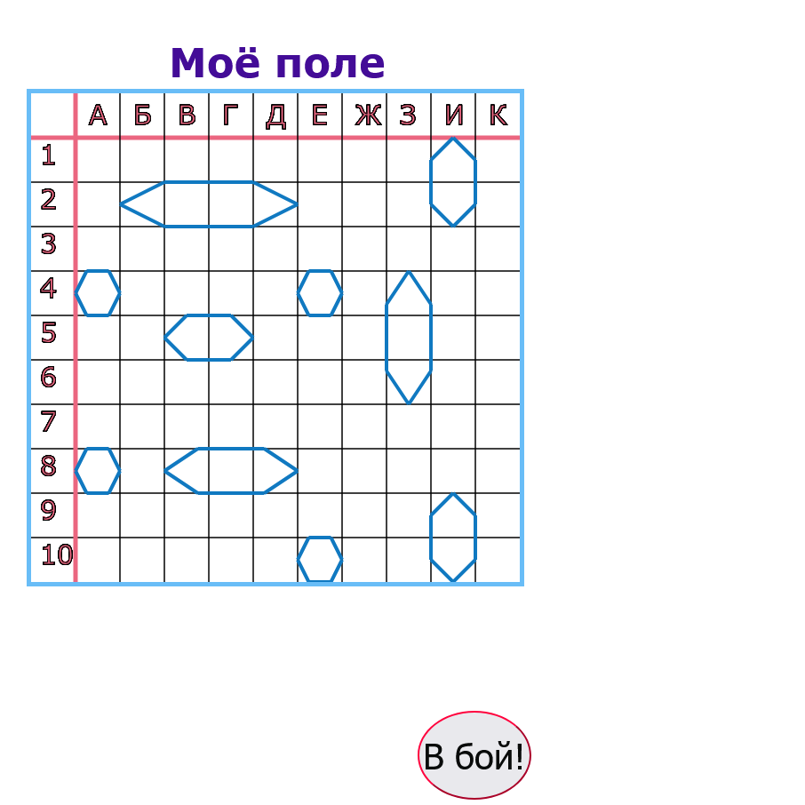
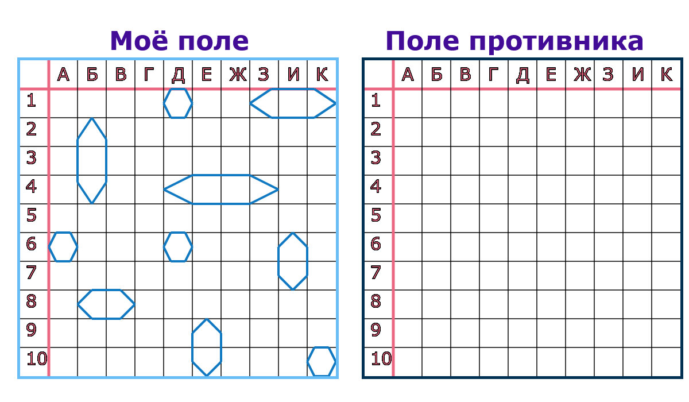
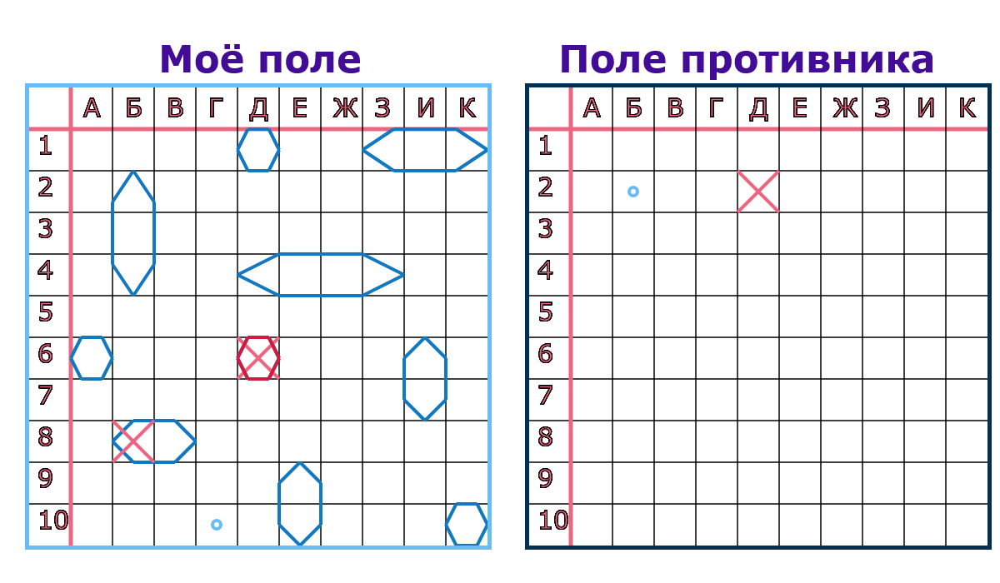
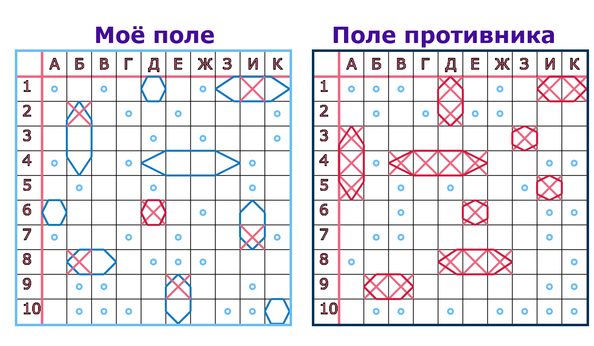
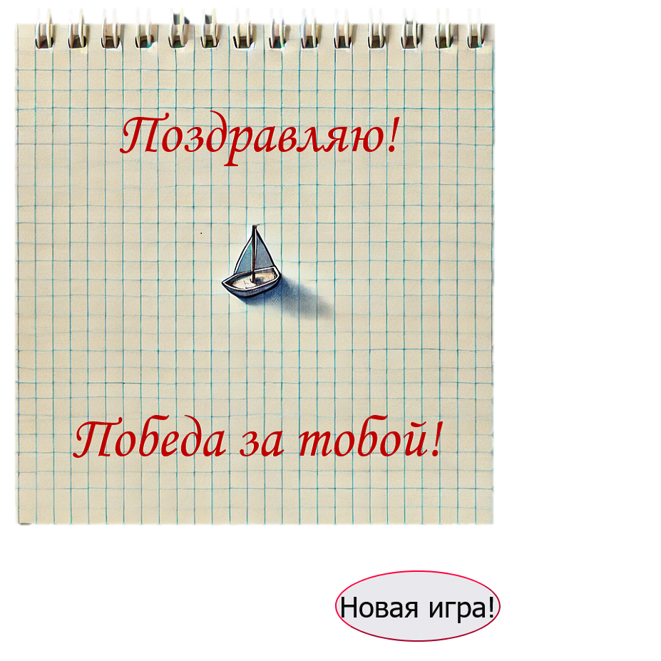
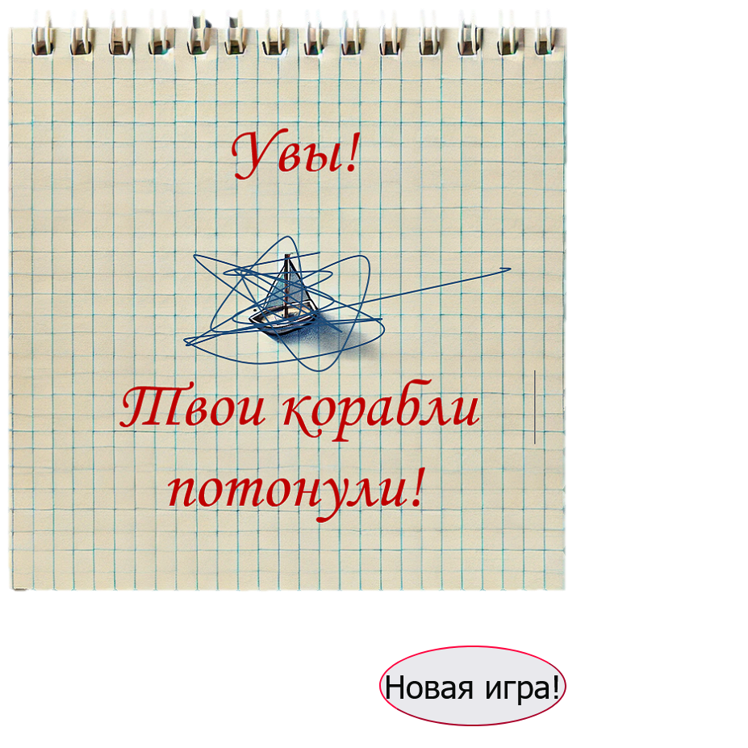

# SeaFight

---
**Игра "Морской бой".** Чтобы стать моряком и иметь свой собственный порт с крейсерами, линкором и катерами в детстве было достаточно трёх вещей: шариковой ручки, тетрадного листа и фантазии. _Данная игра_ поможет окунуться в детство и избавит от необходимости каждый раз чертить новое поле. 
_Игра для персонального компьютера._
**Перед началом игры рекомендуется ознакомиться с правилами.**

---
# Правила игры пошагово:

## Шаг №1

После загрузки всех вложений и открытия файла "index.html", Вас встречает главная страница с игровым полем, на котором _необходимо расположить 10 кораблей_. 

**Флот состоит из 10 кораблей четырёх типов и размещается в порядке убывания:** 
-`1 линкор` — четырёхпалубный, занимает 4 клетки поля;
-`2 крейсера` — трёхпалубные, занимают по 3 клетки;
-`3 эсминца` — двухпалубные, занимают по 2 клетки;
-`4 катера` — однопалубные, обозначаются 1 клеткой.

Движением мыши по полю можно **выбрать местоположение** корабля, а кликом - **зафиксировать** корабль в выбранной точке.
Колёсико мыши - инструмент для **смены ориентации корабля**. 

Если при перемещении по полю корабль имеет _зелёный контур_, то его можно зафиксировать кликом. Фиксированные корабли имеют _синий контур_ без возможности дальнейшего перемещения.

Корабли **не должны соприкасаться друг с другом**. Это правило действует во всех направлениях: корабли не могут касаться ни сторонами, ни углами, даже диагональный контакт запрещён. Во всех перечисленных случаях располагаемый корабль окрашивается _красным цветом_ и требует изменения местоположения.

## Шаг №2

Только после размещения всех 10 кораблей появится кнопка "В бой", с помощью которой можно запустить игру.
 

## Шаг №3

Сразу после запуска игры перед Вами появится поле противника. Право первого хода принадлежит Вам! Чтобы осуществить попытку следует кликнуть по выбранной клетке на поле противника.
 

## Шаг №4

Игроки ходят по очереди и выполняют по 1 "выстрелу". Если ход был неудачным, на поле отобразится голубая точка.
В случае удачной попытки на поле появится красный крестик, который наделяет игрока правом дополнительного хода.
Отображение красного контура корабля - свидетельствует о том, что корабль "потонул".

## Шаг №5

Для одержания победы Вам необходимо первому потопить все корабли противника.

## Результаты игры:
В зависимости от того, кто первый из игроков совершил 20 удачных попыток, Вам будет объявлен соответствующий результат: победа или поражение. Но независимо от результата Вам всегда предложена возможность начать новую игру, кликнув на кнопку ниже.

_Желаю **увлекательной** игры и яркой **победы** !_
